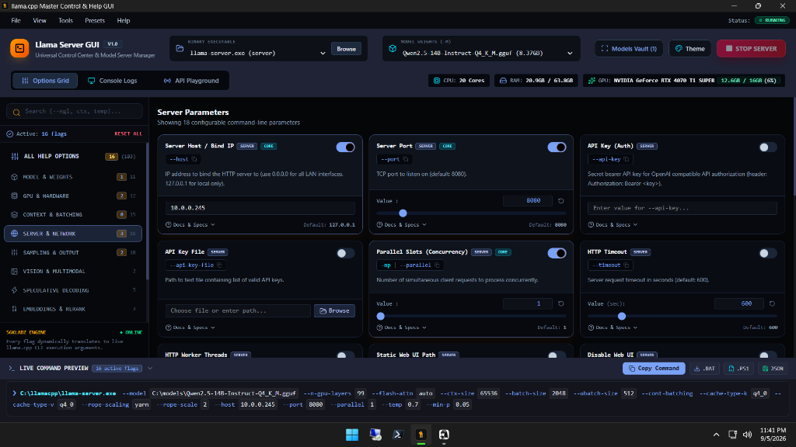

# 🦙 Llama Server GUI

> **The featherweight, high-performance native desktop control deck and flag configurator for `llama-server` and `llama.cpp`. Built with Tauri v2, Rust & React 19.**

[](https://github.com/56KLabz/Llama-Server-GUI)
[](https://github.com/ggml-org/llama.cpp)
[](https://tauri.app)
[](LICENSE)
[](https://56klabz.io)

**Llama Server GUI** is an all-in-one desktop cockpit designed to eliminate the command-line headaches of running `llama.cpp` and `llama-server`. It automatically detects your GPU hardware, tunes layer offloading, discovers local `.gguf` model files, and provides a real-time visual dashboard to launch and monitor local LLM inference at pure silicon speed.



---

## ⚡ 60-Second Quickstart (Beginner Friendly)

You don't need to know command-line flags, CUDA syntax, or batching equations to get started.

### Step 1: Install `llama.cpp` (If you don't already have it)
If you already have `llama-server` in your PATH or build folder, skip this step!

* **On Windows**: Open PowerShell and run:
  ```powershell
  winget install ggml.llamacpp
  ```
  *(Or grab pre-compiled CUDA release zips from the [official llama.cpp releases](https://github.com/ggml-org/llama.cpp/releases)).*

* **On Linux (Ubuntu / Debian / Arch / Fedora)**:
  ```bash
  # Clone and compile with CUDA support
  git clone https://github.com/ggml-org/llama.cpp
  cd llama.cpp && cmake -B build -DGGML_CUDA=ON && cmake --build build --config Release -j
  ```

---

### Step 2: Download Llama Server GUI
Grab the latest featherweight installer from the [Releases](https://github.com/56KLabz/Llama-Server-GUI/releases) page:

* **Windows**:
  * **`Llama-Server-GUI-Setup.exe`** (Standard NSIS installer — **only 2.7 MB**!)
  * **`Llama-Server-GUI.msi`** (Windows Installer package — **4.0 MB**)
* **Linux**:
  * **`Llama-Server-GUI.AppImage`** (Universal portable Linux executable — `chmod +x` and launch)
  * **`llama-server-gui.deb`** (Ubuntu / Debian package)

---

### Step 3: Launch & Start Chatting
1. **Launch the App**: The GUI automatically scans your `Downloads`, `Documents`, and system paths for your `llama-server` binary and any `.gguf` models you have saved.
2. **Auto Hardware Tuning**: If you have an NVIDIA GPU, it automatically configures all layers (`-ngl 99`) and Flash Attention (`-fa on`) to give you maximum tokens/sec out of the box.
3. **Click `START SERVER`**: Your local OpenAI-compatible API is live in seconds.
4. **Chat**: Click the **API Playground** tab (`F3`) at the top to chat with your model immediately with live streaming tokens and latency metrics.

---

## 🔌 Connecting to Other Apps (OpenAI Compatible)

When your server is running, **Llama Server GUI** hosts a local OpenAI-compatible endpoint at:
```text
http://127.0.0.1:8080/v1
```

You can plug this URL directly into your favorite AI tools:
* **OpenWebUI / LibreChat**: Set Base URL to `http://127.0.0.1:8080/v1` (API Key: anything).
* **VS Code (Continue / Roo Code / Cline)**: Select "OpenAI Compatible" provider and point to port `8080`.
* **Obsidian (Smart Connections / BMO Chat)**: Set local base URL to `http://127.0.0.1:8080/v1`.
* **SillyTavern**: Select Chat Completion $\rightarrow$ OpenAI $\rightarrow$ `http://127.0.0.1:8080/v1`.
* **Python / LangChain / AutoGen**:
  ```python
  from openai import OpenAI

  client = OpenAI(base_url="http://127.0.0.1:8080/v1", api_key="not-needed")
  response = client.chat.completions.create(
      model="default",
      messages=[{"role": "user", "content": "Hello world!"}]
  )
  print(response.choices[0].message.content)
  ```

---

## ✨ Features

- 🚀 **Featherweight Architecture**: Powered by **Tauri v2 + Rust** — uses **~30MB of RAM** and ships as a **2.7 MB installer** (over 95% smaller than traditional Electron wrappers).
- ⚙️ **100+ Configurable Flags**: Visual controls for GPU layer offloading, Flash Attention, KV Cache Quantization (`q8_0`, `q4_0`), samplers (temp, top-k, min-p, mirostat), context sizes, and multi-model router mode (`--models-dir`).
- ⚡ **Real-Time Hardware Telemetry**: Live header display tracking GPU name, active VRAM usage (`used / total GB`), GPU load %, CPU cores, and system memory.
- 🔍 **Strict GGUF Asset Vault**: Automatically indexes all `.gguf` weights across your drives while strictly ignoring unrelated binaries.
- 🖥️ **Live Command String Builder**: Watch the exact `llama-server <args>` command string construct live as you toggle flags. Export one-click `.bat`, `.sh`, `.ps1`, or `.json` profiles.
- 💬 **Integrated Chat Playground**: Test your prompt generation and model responses with streaming tokens directly in the app.
- 🎨 **7 Developer Themes**: Switch instantly between **Noir Obsidian (Default)**, **Tokyo Night**, **Catppuccin Mocha**, **Dracula Dark**, **Gruvbox Retro**, **Nordic Frost**, and **Cyberpunk Neon** (`Ctrl+T`).
- 🛑 **Clean Process Management**: Instant termination and memory release via native OS process signals.

---

## ⌨️ Keyboard Shortcuts Reference

| Shortcut | Action |
|---|---|
| `F1` | Switch to **Options Matrix** |
| `F2` | Switch to **Console Stream & Logs** |
| `F3` | Switch to **API Chat Playground** |
| `Ctrl + O` | Browse & Open GGUF Model File |
| `Ctrl + B` | Select Llama Executable Binary |
| `Ctrl + T` | Open Color Themes Palette |
| `Ctrl + \`` | Toggle Live Command Preview Bar |
| `Ctrl + Shift + S` | Open Local Models Vault Scanner |
| `Ctrl + H` | Ingest Flags Dynamically from `--help` |

---

## 🛠️ Building from Source (Developers)

Prerequisites: [Node.js](https://nodejs.org) (v18+) and [Rust](https://www.rust-lang.org/tools/install) (1.77+).

```bash
# 1. Clone repository
git clone https://github.com/56KLabz/Llama-Server-GUI.git
cd Llama-Server-GUI

# 2. Install frontend dependencies
npm install

# 3. Launch live hot-reloading desktop development environment
npm run tauri:dev

# 4. Build optimized production release installers
npm run tauri:build
```

The compiled release packages will be in `src-tauri/target/release/bundle/nsis/` and `src-tauri/target/release/bundle/msi/`.

---

## 🤝 Contributing
Contributions are what make the open-source community an incredible place to learn, inspire, and create. Any contributions you make are **greatly appreciated**.

Please review our [Contributing Guidelines](CONTRIBUTING.md) for development setup and pull request workflows.

---

## 🛡️ License
Distributed under the Apache 2.0 License. See [LICENSE](LICENSE) for more information.

---

<p align="center">
  <b>Brought to you by <a href="https://56klabz.io">56kLabz</a></b><br>
  <i>"Speed, Control, and Pure Silicon."</i>
</p>
